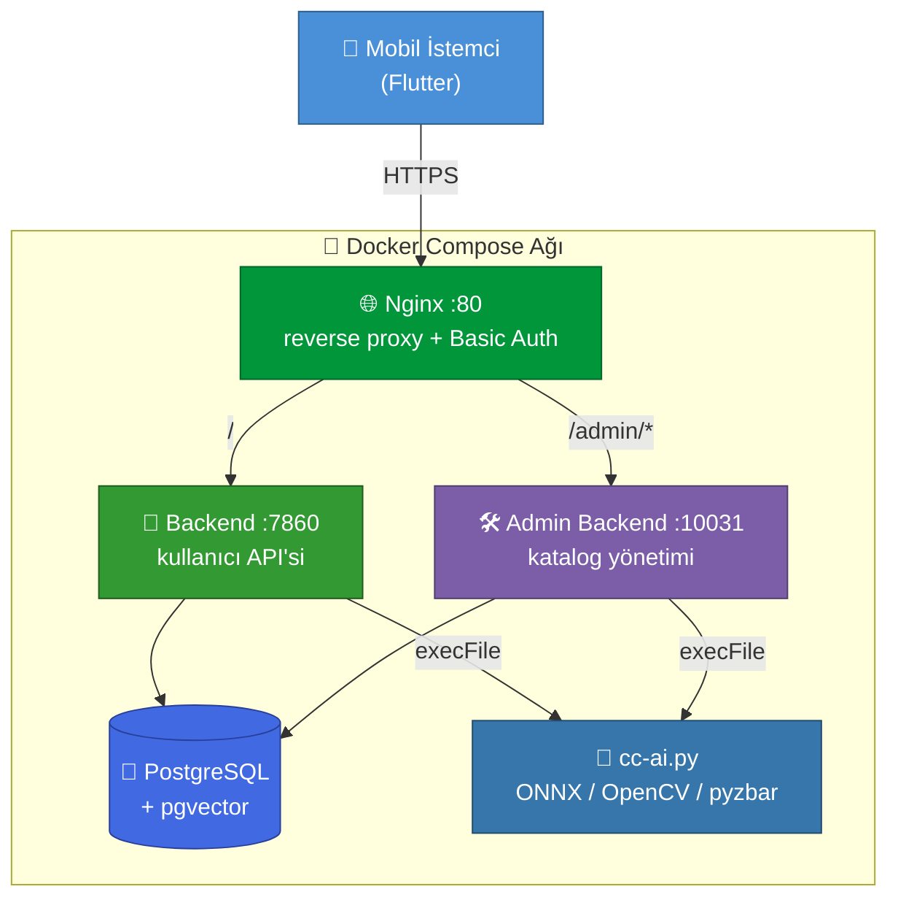
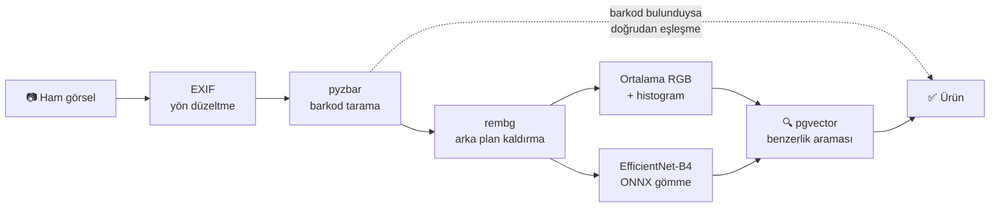

<div align="center">

# 🛒 Clear Cart

**Ürünün fotoğrafını çek — içindeki alerjeni saniyeler içinde öğren.**

Barkod okuma ve görsel benzerlik aramasını birleştirerek market ürünlerini tanıyan,
kullanıcının alerjen profiliyle eşleştiren Docker tabanlı backend sistemi.

[](LICENSE)
[](https://nodejs.org)
[](https://expressjs.com)
[](https://github.com/pgvector/pgvector)
[](https://onnxruntime.ai)
[](https://docs.docker.com/compose/)

</div>

---

## Ne yapar?

Gıda alerjisi olan biri için market alışverişi, her ürünün arkasındaki küçük puntolu içerik
listesini tek tek okumak demektir. Clear Cart bu adımı ortadan kaldırır:

1. Kullanıcı ürünün fotoğrafını çeker.
2. Sistem **barkodu okumayı** dener — barkod okunursa eşleşme kesindir.
3. Barkod yoksa veya okunamazsa **görsel benzerlik** devreye girer: fotoğraftan çıkarılan
   1000 boyutlu gömme vektörü (EfficientNet-B4), ortalama RGB ve renk histogramı, katalogdaki
   ürünlerle pgvector üzerinden karşılaştırılır.
4. Eşleşen ürünün içerik listesi, kullanıcının **kendi alerjen profiliyle** kesiştirilir.
5. Sonuç: "Bu üründe FINDIK var" — ya da temiz.

## Mimari



### Görsel işleme hattı



### Servisler

| Servis | Konteyner | Port | Görev |
|---|---|---|---|
| Backend | `clearcart-backend` | 7860 | Kayıt/giriş, alerjen tercihleri, görsel arama |
| Admin Backend | `clearcart-admin-backend` | 10031 | Ürün, içerik ve alerjen yönetimi |
| PostgreSQL | `clearcart-db` | 5432 | pgvector eklentili veritabanı |
| Nginx | `clearcart-nginx` | 80 | Reverse proxy + admin için Basic Auth |
| NGROK | `clearcart-ngrok` | — | Geliştirme sırasında dışarıya tünel |

**Teknolojiler:** Node.js 20 (ES modules) · Express · PostgreSQL + pgvector · Python (ONNX Runtime, OpenCV, rembg, pyzbar) · EfficientNet-B4 · JWT (RS256) · bcrypt · Docker Compose

---

## Hızlı başlangıç

```bash
git clone https://github.com/talhaymn7/clearcart-docker.git
cd clearcart-docker

# 1) Ortam değişkenleri
cp .env.example .env
openssl rand -base64 24   # POSTGRES_PASSWORD için
openssl rand -hex 64      # JWT_SECRET için

# 2) Admin paneli Basic Auth kullanıcısı
htpasswd -B -c nginx/.htpasswd admin

# 3) Ayağa kaldır (şema ilk açılışta otomatik uygulanır)
docker compose up -d --build
curl http://localhost/health     # -> ok
```

NGROK tüneli isterseniz ayrı bir profille açılır:

```bash
docker compose --profile ngrok up -d
```

<details>
<summary><b>Ayrıntılı kurulum</b></summary>

### Gereksinimler
- Docker ve Docker Compose
- `openssl` ve `htpasswd` (apache2-utils)

### Ortam değişkenleri

`.env.example` dosyasını `.env` olarak kopyalayıp doldurun. Google OAuth kullanacaksanız
`GOOGLE_CLIENT_ID` ve `ANDROID_CLIENT_ID_FOR_GOOGLE` değerlerini Google Cloud Console →
Credentials üzerinden alın. NGROK tüneli istiyorsanız
[ngrok dashboard](https://dashboard.ngrok.com/get-started/your-authtoken)'dan token alın.

### Basic Auth kullanıcıları

```bash
htpasswd -B -c nginx/.htpasswd admin          # ilk kullanıcı (-c dosyayı oluşturur)
htpasswd -B nginx/.htpasswd ikinci_kullanici  # sonrakiler (-c OLMADAN)
```

> `-B` bcrypt kullanır. Varsayılan `-m` (MD5) modern donanımda hızlıca kırılır, kullanmayın.

### Admin hesabı

```bash
cd ad-b && python create-passwd-for-backend.py
```

Üretilen hash'i veritabanına ekleyin:

```sql
INSERT INTO adm_users (email, password) VALUES ('admin@example.com', '<hash>');
```

### Veritabanı şifresi hakkında

`.env` içindeki `POSTGRES_PASSWORD` yalnızca veritabanı **ilk kez** oluşturulurken uygulanır.
Mevcut bir `postgres_data` volume'ünüz varsa şifre eskisi olarak kalır:

```sql
-- docker exec -it clearcart-db psql -U postgres -d clearcart
ALTER USER postgres WITH PASSWORD 'yeni_sifre';
```

</details>

---

## API

### Kullanıcı API'si (`:7860`)

| Metot | Uç | Auth | Açıklama |
|---|---|:--:|---|
| `GET` | `/` | — | Sağlık kontrolü |
| `GET` | `/auth/public-key` | — | JWT doğrulama için public key |
| `POST` | `/register` | — | Kayıt |
| `POST` | `/login` | — | Giriş |
| `POST` | `/auth/google` | — | Google ile giriş |
| `PATCH` | `/refresh-token` | 🔑 | Token yenileme |
| `POST` | `/change-password` | 🔑 | Şifre değiştirme |
| `POST` | `/update-profile` | 🔑 | Profil güncelleme |
| `GET` | `/my-informations` | 🔑 | Profil bilgileri |
| `GET` | `/list-all-allergens` | — | Tüm alerjenler |
| `GET` | `/search-allergens?q=` | — | Alerjen arama |
| `GET` | `/list-user-allergens` | 🔑 | Kullanıcının alerjenleri |
| `POST` | `/update-allergens` | 🔑 | Alerjen tercihlerini güncelle |
| `POST` | `/products/image-search` | 🔑 | **Görselden ürün arama** |
| `GET` | `/products/:id/full-info` | 🔑 | Ürün içeriği + alerjen eşleşmesi |
| `POST` | `/send-feedback` | 🔑 | Geri bildirim (görsel ekli) |

### Admin API'si (`:10031`, `/admin/v1`)

Yalnızca `/admin/v1/login` açıktır; **diğer tüm uçlar** kimlik doğrulaması ister
(`x-auth-token` başlığı) ve ayrıca Nginx Basic Auth'un arkasındadır.

<details>
<summary><b>Admin uçlarının tam listesi</b></summary>

| Metot | Uç | Açıklama |
|---|---|---|
| `POST` | `/admin/v1/login` | Admin girişi |
| `POST` | `/admin/v1/change-password` | Şifre değiştirme |
| `GET` | `/admin/v1/dashboard/stats` | Özet istatistikler |
| `GET` | `/admin/v1/products/list-products` | Ürün listesi |
| `POST` | `/admin/v1/products/add-without-photo` | Fotoğrafsız ürün ekleme |
| `POST` | `/admin/v1/products/add-with-photo` | Fotoğraflı ürün ekleme + AI analizi |
| `GET` | `/admin/v1/products/:id/view` | Ürün detayı |
| `PUT` | `/admin/v1/products/:id/edit` | Ürün güncelleme |
| `PUT` | `/admin/v1/products/:id/update-with-photo` | Fotoğraflı güncelleme + AI |
| `DELETE` | `/admin/v1/products/:id/delete` | Ürün silme |
| `GET` | `/admin/v1/products/:id/photos` | Ürün fotoğrafları |
| `POST` | `/admin/v1/products/:id/add-photo` | Fotoğraf ekleme |
| `DELETE` | `/admin/v1/products/photos/delete` | Fotoğraf silme |
| `GET` | `/admin/v1/products/:id/relations` | Ürün içerik ilişkileri |
| `POST` | `/admin/v1/products/:id/relations` | İlişkileri güncelle |
| `GET` | `/admin/v1/products/:id/ingredients` | İçerik listesi + seçim durumu |
| `POST` | `/admin/v1/products/:id/update-ingredients` | İçerikleri güncelle |
| `GET` | `/admin/v1/ingredients/search?q=` | İçerik arama |
| `POST` | `/admin/v1/ingredients/add` | İçerik ekleme |
| `PUT` | `/admin/v1/ingredients/:id/edit` | İçerik güncelleme |
| `DELETE` | `/admin/v1/ingredients/:id/delete` | İçerik silme |
| `GET` | `/admin/v1/allergens/list-all-allergens` | Alerjen listesi |
| `GET` | `/admin/v1/allergens/search-allergens?q=` | Alerjen arama |
| `POST` | `/admin/v1/allergens/add-allergen` | Alerjen ekleme |
| `GET` | `/admin/v1/allergens/:id/full-info` | Alerjen detayı |
| `PUT` | `/admin/v1/allergens/:id/edit` | Alerjen güncelleme |
| `DELETE` | `/admin/v1/allergens/:id/delete` | Alerjen silme |
| `GET` | `/admin/v1/feedbacks/list` | Geri bildirimler |
| `GET` | `/admin/v1/feedbacks/image/:filename` | Geri bildirim görseli |

</details>

---

## Proje yapısı

```
clearcart-docker/
├── backend/                 # Kullanıcı API'si (:7860)
│   ├── index.js             # Express app, auth, kullanıcı uçları
│   ├── security.js          # JWT imzalama/doğrulama, RSA şifre çözme
│   ├── cc-ai.py             # Barkod okuma + gömme çıkarma
│   ├── middlewares/         # Görsel yükleme (uzantı beyaz listesi)
│   └── models/              # EfficientNet-B4 ONNX
├── ad-b/                    # Admin API'si (:10031)
│   ├── adm-index.js         # Katalog yönetimi + audit log
│   └── security.js
├── db/01-schema.sql         # Şema — ilk açılışta otomatik uygulanır
├── nginx/nginx.conf         # Yönlendirme + Basic Auth
├── docker-compose.yml
└── .env.example             # Ortam değişkeni şablonu
```

### Veritabanı

Şema `db/01-schema.sql` içinde tanımlı ve PostgreSQL konteyneri **ilk kez** oluşturulurken
`/docker-entrypoint-initdb.d/` üzerinden otomatik çalışır. Mevcut bir volume varsa
çalışmaz — sıfırdan kurmak için `docker compose down -v && docker compose up -d`.

Tablolar: `default_users` · `adm_users` · `products` · `ingredients` · `product_ingredients` ·
`allergens` · `user_allergens` · `user_feedback` · `admin_audit_logs`

Ayrıca `search_product(embedding, color, histogram, barcode)` fonksiyonu: barkod okunduysa
kesin eşleşme, değilse gömme vektörü kosinüs benzerliğini renk ve histogramla ağırlıklı
birleştirerek en yakın 5 ürünü döndürür.

---

## Geliştirme

```bash
# Yerel çalıştırma
cd backend && npm install && npm start     # :7860
cd ad-b && npm install && npm start        # :10031

# Veritabanı kabuğu
docker exec -it clearcart-db psql -U postgres -d clearcart

# AI script'ini tek başına test et
cd backend && python3 cc-ai.py path/to/image.jpg

# Loglar
docker compose logs -f backend
```

### Veritabanı yedekleme / taşıma

```bash
./migration.sh      # Linux/Mac: restore
./migration.ps1     # Windows: yedek alma ve paketleme
```

> ⚠️ Üretilen `.sql` dosyaları kişisel veri içerir (e-posta, telefon, şifre hash'leri, token'lar).
> `.gitignore` bunları hariç tutar — asla commit etmeyin.

---

## Güvenlik

Ayrıntı ve zafiyet bildirimi için **[SECURITY.md](SECURITY.md)**.

- JWT'ler **RS256** ile imzalanır; anahtarlar imaj build'inde üretilir, repoya girmez.
- Kullanıcı ve admin servisleri **ayrı anahtar çiftleri** kullanır — `backend/keys` dizinini
  admin servisine mount etmeyin, aksi halde sıradan bir kullanıcı token'ı admin uçlarında da
  geçerli imzaya sahip olur.
- `/admin/v1` altındaki **tüm** uçlar router seviyesinde yetkilendirmeden geçer; yeni bir uç
  eklendiğinde koruma unutulamaz.
- Yüklenen dosyaların uzantısı beyaz listeye karşı doğrulanır, adları sunucuda üretilir,
  hedef yolun izin verilen dizinde kaldığı ayrıca doğrulanır.
- Kimlik doğrulama uçlarında oran sınırlama; giriş yanıtları kullanıcı numaralandırmasına kapalı.
- Gizli değerler yalnızca `.env` içinde tutulur.

## Bilinen sınırlar

- TLS sonlandırması bu depoda yoktur; üretimde önüne HTTPS yapan bir katman koyun.
- Token iptali uygulanmamıştır: JWT'ler süreleri dolana kadar geçerlidir.
- `computeEmbeddingsAndBuildIndex.js` ve `buildIndex.js` eski Turso/libSQL bağlantısını kullanır
  ve aktif PostgreSQL veritabanıyla çalışmaz.

## Lisans

[PolyForm Noncommercial License 1.0.0](LICENSE) © 2026 A. Talha Yaman
