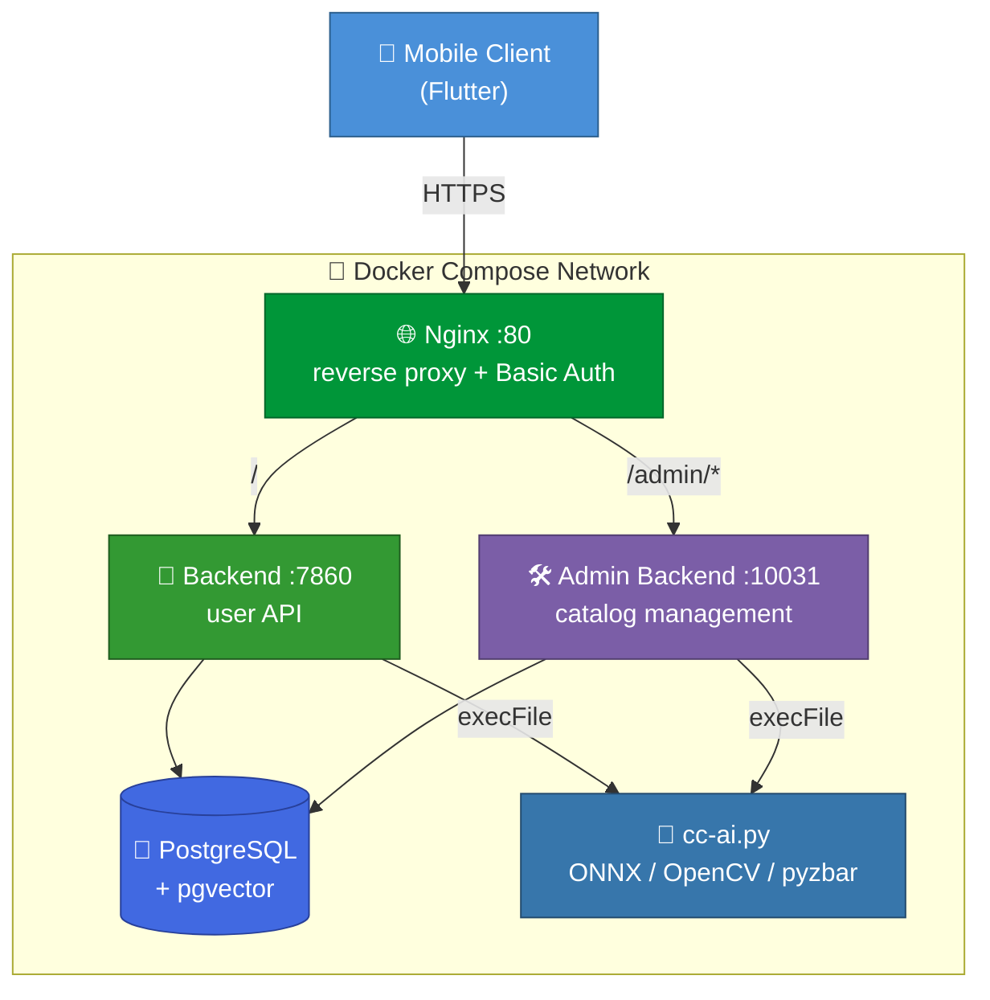
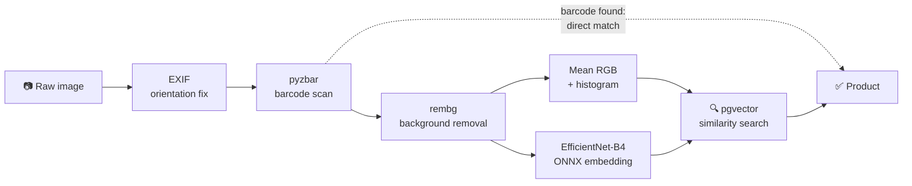

<div align="center">

# 🛒 Clear Cart

**Take a photo of a product — find out what allergens are in it within seconds.**

A Docker-based backend system that recognizes grocery products by combining barcode
scanning with visual similarity search, then matches them against the user's allergen profile.

[](LICENSE)
[](https://nodejs.org)
[](https://expressjs.com)
[](https://github.com/pgvector/pgvector)
[](https://onnxruntime.ai)
[](https://docs.docker.com/compose/)

</div>

---

## What it does

For someone with a food allergy, grocery shopping means reading the fine-print ingredient
list on the back of every single product. Clear Cart removes that step:

1. The user takes a photo of the product.
2. The system first tries to **read the barcode** — if it scans, the match is exact.
3. If there is no barcode or it can't be read, **visual similarity** takes over: a
   1000-dimensional embedding vector (EfficientNet-B4), the mean RGB value and a color
   histogram are extracted from the photo and compared against the catalog via pgvector.
4. The matched product's ingredient list is intersected with the user's **own allergen profile**.
5. The result: "This product contains HAZELNUTS" — or it's clean.

## Architecture



### Image processing pipeline



### Services

| Service | Container | Port | Role |
|---|---|---|---|
| Backend | `clearcart-backend` | 7860 | Sign-up/sign-in, allergen preferences, visual search |
| Admin Backend | `clearcart-admin-backend` | 10031 | Product, ingredient and allergen management |
| PostgreSQL | `clearcart-db` | 5432 | Database with the pgvector extension |
| Nginx | `clearcart-nginx` | 80 | Reverse proxy + Basic Auth for admin |
| NGROK | `clearcart-ngrok` | — | Outbound tunnel during development |

**Stack:** Node.js 20 (ES modules) · Express · PostgreSQL + pgvector · Python (ONNX Runtime, OpenCV, rembg, pyzbar) · EfficientNet-B4 · JWT (RS256) · bcrypt · Docker Compose

---

## Quick start

```bash
git clone https://github.com/talhaymn7/clearcart-docker.git
cd clearcart-docker

# 1) Environment variables
cp .env.example .env
openssl rand -base64 24   # for POSTGRES_PASSWORD
openssl rand -hex 64      # for JWT_SECRET

# 2) Basic Auth user for the admin panel
htpasswd -B -c nginx/.htpasswd admin

# 3) Bring it up (the schema is applied automatically on first start)
docker compose up -d --build
curl http://localhost/health     # -> ok
```

If you want the NGROK tunnel, it starts under a separate profile:

```bash
docker compose --profile ngrok up -d
```

<details>
<summary><b>Detailed setup</b></summary>

### Requirements
- Docker and Docker Compose
- `openssl` and `htpasswd` (apache2-utils)

### Environment variables

Copy `.env.example` to `.env` and fill it in. If you plan to use Google OAuth, get the
`GOOGLE_CLIENT_ID` and `ANDROID_CLIENT_ID_FOR_GOOGLE` values from Google Cloud Console →
Credentials. For the NGROK tunnel, grab a token from the
[ngrok dashboard](https://dashboard.ngrok.com/get-started/your-authtoken).

### Basic Auth users

```bash
htpasswd -B -c nginx/.htpasswd admin        # first user (-c creates the file)
htpasswd -B nginx/.htpasswd second_user     # any further users (WITHOUT -c)
```

> `-B` uses bcrypt. The default `-m` (MD5) is cracked quickly on modern hardware — don't use it.

### Admin account

```bash
cd ad-b && python create-passwd-for-backend.py
```

Insert the generated hash into the database:

```sql
INSERT INTO adm_users (email, password) VALUES ('admin@example.com', '<hash>');
```

### About the database password

`POSTGRES_PASSWORD` in `.env` is only applied when the database is created for the **first**
time. If you already have a `postgres_data` volume, the old password stays in effect:

```sql
-- docker exec -it clearcart-db psql -U postgres -d clearcart
ALTER USER postgres WITH PASSWORD 'new_password';
```

</details>

---

## API

### User API (`:7860`)

| Method | Endpoint | Auth | Description |
|---|---|:--:|---|
| `GET` | `/` | — | Health check |
| `GET` | `/auth/public-key` | — | Public key for JWT verification |
| `POST` | `/register` | — | Sign up |
| `POST` | `/login` | — | Sign in |
| `POST` | `/auth/google` | — | Sign in with Google |
| `PATCH` | `/refresh-token` | 🔑 | Refresh token |
| `POST` | `/change-password` | 🔑 | Change password |
| `POST` | `/update-profile` | 🔑 | Update profile |
| `GET` | `/my-informations` | 🔑 | Profile details |
| `GET` | `/list-all-allergens` | — | All allergens |
| `GET` | `/search-allergens?q=` | — | Search allergens |
| `GET` | `/list-user-allergens` | 🔑 | The user's allergens |
| `POST` | `/update-allergens` | 🔑 | Update allergen preferences |
| `POST` | `/products/image-search` | 🔑 | **Product search by image** |
| `GET` | `/products/:id/full-info` | 🔑 | Ingredients + allergen matches |
| `POST` | `/send-feedback` | 🔑 | Feedback (with image attachment) |

### Admin API (`:10031`, `/admin/v1`)

Only `/admin/v1/login` is open; **every other endpoint** requires authentication
(`x-auth-token` header) and additionally sits behind Nginx Basic Auth.

<details>
<summary><b>Full list of admin endpoints</b></summary>

| Method | Endpoint | Description |
|---|---|---|
| `POST` | `/admin/v1/login` | Admin sign-in |
| `POST` | `/admin/v1/change-password` | Change password |
| `GET` | `/admin/v1/dashboard/stats` | Summary statistics |
| `GET` | `/admin/v1/products/list-products` | Product list |
| `POST` | `/admin/v1/products/add-without-photo` | Add product without photo |
| `POST` | `/admin/v1/products/add-with-photo` | Add product with photo + AI analysis |
| `GET` | `/admin/v1/products/:id/view` | Product details |
| `PUT` | `/admin/v1/products/:id/edit` | Update product |
| `PUT` | `/admin/v1/products/:id/update-with-photo` | Update with photo + AI |
| `DELETE` | `/admin/v1/products/:id/delete` | Delete product |
| `GET` | `/admin/v1/products/:id/photos` | Product photos |
| `POST` | `/admin/v1/products/:id/add-photo` | Add photo |
| `DELETE` | `/admin/v1/products/photos/delete` | Delete photo |
| `GET` | `/admin/v1/products/:id/relations` | Product ingredient relations |
| `POST` | `/admin/v1/products/:id/relations` | Update relations |
| `GET` | `/admin/v1/products/:id/ingredients` | Ingredient list + selection state |
| `POST` | `/admin/v1/products/:id/update-ingredients` | Update ingredients |
| `GET` | `/admin/v1/ingredients/search?q=` | Search ingredients |
| `POST` | `/admin/v1/ingredients/add` | Add ingredient |
| `PUT` | `/admin/v1/ingredients/:id/edit` | Update ingredient |
| `DELETE` | `/admin/v1/ingredients/:id/delete` | Delete ingredient |
| `GET` | `/admin/v1/allergens/list-all-allergens` | Allergen list |
| `GET` | `/admin/v1/allergens/search-allergens?q=` | Search allergens |
| `POST` | `/admin/v1/allergens/add-allergen` | Add allergen |
| `GET` | `/admin/v1/allergens/:id/full-info` | Allergen details |
| `PUT` | `/admin/v1/allergens/:id/edit` | Update allergen |
| `DELETE` | `/admin/v1/allergens/:id/delete` | Delete allergen |
| `GET` | `/admin/v1/feedbacks/list` | Feedback submissions |
| `GET` | `/admin/v1/feedbacks/image/:filename` | Feedback image |

</details>

---

## Project structure

```
clearcart-docker/
├── backend/                 # User API (:7860)
│   ├── index.js             # Express app, auth, user endpoints
│   ├── security.js          # JWT signing/verification, RSA decryption
│   ├── cc-ai.py             # Barcode reading + embedding extraction
│   ├── middlewares/         # Image upload (extension whitelist)
│   └── models/              # EfficientNet-B4 ONNX
├── ad-b/                    # Admin API (:10031)
│   ├── adm-index.js         # Catalog management + audit log
│   └── security.js
├── db/01-schema.sql         # Schema — applied automatically on first start
├── nginx/nginx.conf         # Routing + Basic Auth
├── docker-compose.yml
└── .env.example             # Environment variable template
```

### Database

The schema lives in `db/01-schema.sql` and runs automatically via
`/docker-entrypoint-initdb.d/` when the PostgreSQL container is created for the **first**
time. It does not run if a volume already exists — for a clean install, use
`docker compose down -v && docker compose up -d`.

Tables: `default_users` · `adm_users` · `products` · `ingredients` · `product_ingredients` ·
`allergens` · `user_allergens` · `user_feedback` · `admin_audit_logs`

There is also a `search_product(embedding, color, histogram, barcode)` function: if a barcode
was read it returns an exact match, otherwise it combines the embedding's cosine similarity
with color and histogram scores in a weighted fashion and returns the 5 closest products.

---

## Development

```bash
# Running locally
cd backend && npm install && npm start     # :7860
cd ad-b && npm install && npm start        # :10031

# Database shell
docker exec -it clearcart-db psql -U postgres -d clearcart

# Test the AI script on its own
cd backend && python3 cc-ai.py path/to/image.jpg

# Logs
docker compose logs -f backend
```

### Database backup / migration

```bash
./migration.sh      # Linux/Mac: restore
./migration.ps1     # Windows: dump and package
```

> ⚠️ The generated `.sql` files contain personal data (e-mail addresses, phone numbers,
> password hashes, tokens). `.gitignore` excludes them — never commit them.

---

## Security

See **[SECURITY.md](SECURITY.md)** for the details and for reporting vulnerabilities.

- JWTs are signed with **RS256**; the keys are generated at image build time and never enter
  the repository.
- The user and admin services use **separate key pairs** — do not mount the `backend/keys`
  directory into the admin service, otherwise an ordinary user token would carry a valid
  signature on the admin endpoints too.
- **Every** endpoint under `/admin/v1` passes through router-level authorization, so
  protection can't be forgotten when a new endpoint is added.
- Uploaded file extensions are validated against a whitelist, filenames are generated on the
  server, and the resolved target path is additionally verified to stay inside the allowed
  directory.
- Rate limiting on the authentication endpoints; sign-in responses are closed to user
  enumeration.
- Secrets are kept in `.env` only.

## Known limitations

- TLS termination is not part of this repository; put an HTTPS-terminating layer in front of
  it in production.
- Token revocation is not implemented: JWTs stay valid until they expire.
- `computeEmbeddingsAndBuildIndex.js` and `buildIndex.js` use the legacy Turso/libSQL
  connection and do not work with the active PostgreSQL database.

## License

[PolyForm Noncommercial License 1.0.0](LICENSE) © 2026 A. Talha Yaman
